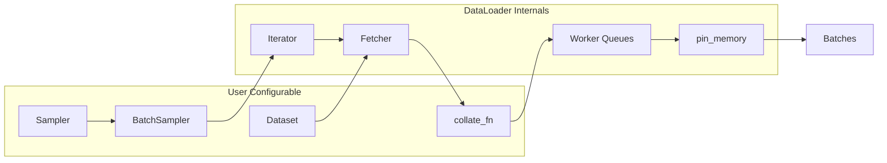
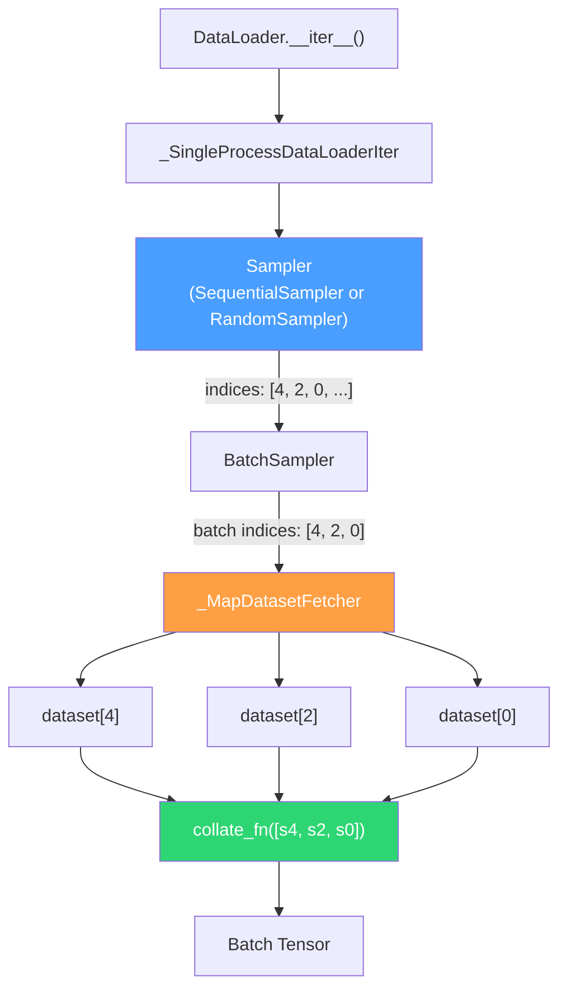
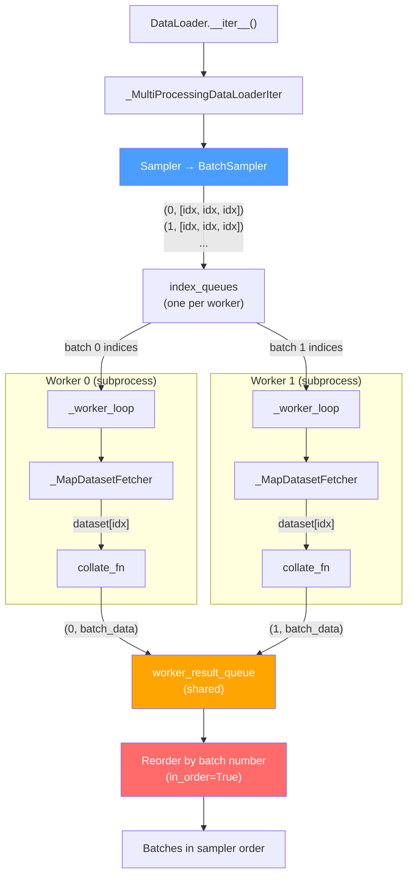
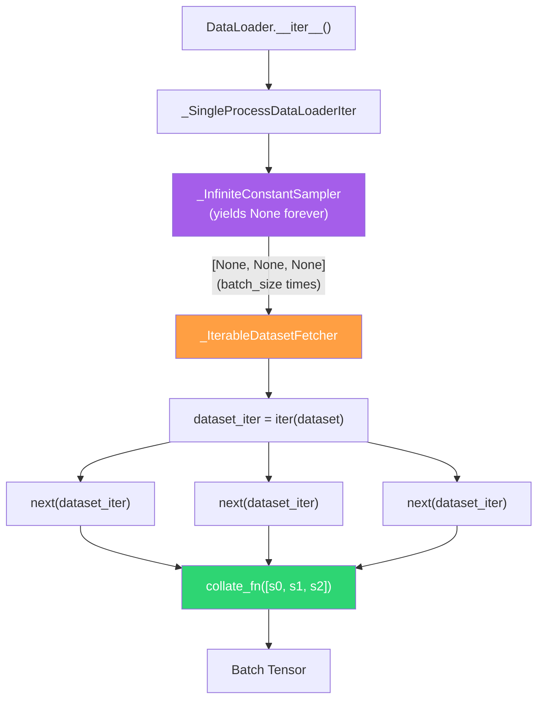
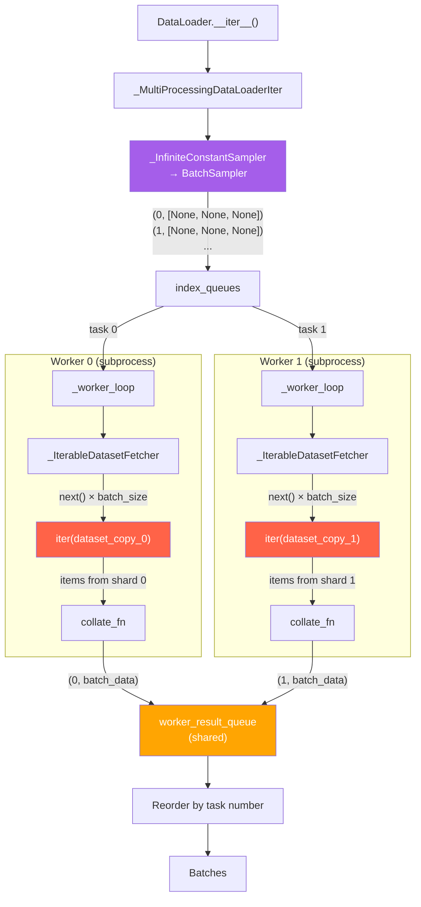
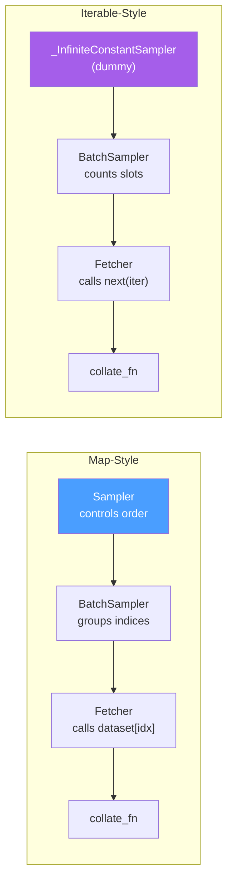

# DataLoader Architecture

Visual guide to how PyTorch DataLoaders work internally.

---

## Component Overview

The DataLoader is composed of several pluggable components. Which ones are active depends on the dataset type and configuration.

| Component | Role | Default |
|-----------|------|---------|
| **Dataset** | Holds or generates the data | User-provided |
| **Sampler** | Produces indices (map-style only) | `SequentialSampler` or `RandomSampler` |
| **BatchSampler** | Groups sampler indices into batches | `BatchSampler(sampler, batch_size)` |
| **Fetcher** | Retrieves data from dataset | `_MapDatasetFetcher` or `_IterableDatasetFetcher` |
| **collate_fn** | Converts list of samples into a batch | `default_collate` (stacks tensors) |
| **pin_memory** | Copies batch to pinned (page-locked) memory for faster GPU transfer | Disabled |

---

## Map-Style: Single Worker (`num_workers=0`)

Everything runs in the main process. The sampler controls access order.

**Key point:** The Sampler decides the order. The Fetcher just calls `dataset[idx]` for each index in the batch.

---

## Map-Style: Multiple Workers (`num_workers>0`)

Workers fetch data in parallel, but the output queue preserves sampler order.

**Key point:** Each batch is tagged with a batch number. The main process yields batches in order of that number, even if Worker 1 finishes before Worker 0. This is why map-style ordering is deterministic regardless of worker timing.

---

## Iterable-Style: Single Worker (`num_workers=0`)

The dataset controls iteration. The sampler is a dummy that just counts batch slots.

**Key point:** No real sampler. The Fetcher just calls `next()` on the dataset's iterator `batch_size` times to fill each batch. The dataset decides what comes out.

---

## Iterable-Style: Multiple Workers (`num_workers>0`)

Each worker gets its own copy of the dataset and its own iterator.

**Key point:** Each worker has an independent copy of the dataset and iterator. Without sharding logic in `__iter__`, every worker yields the full dataset (data duplication). The task-number reordering preserves the round-robin assignment order, but the *content* depends on what each worker's iterator yields — which can be timing-dependent.

---

## Map-Style vs Iterable-Style: Summary

|  | Map-Style | Iterable-Style |
|--|-----------|----------------|
| **Who controls order?** | Sampler (external to dataset) | Dataset's `__iter__` (internal) |
| **Shuffling** | `shuffle=True` on DataLoader | Must implement in `__iter__` |
| **Multi-worker** | Automatic index distribution | Must shard manually |
| **Deterministic order** | Yes (sampler + output queue) | Depends on worker timing |
| **`len()` support** | Yes (`__len__`) | No |
