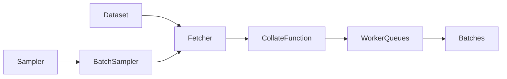
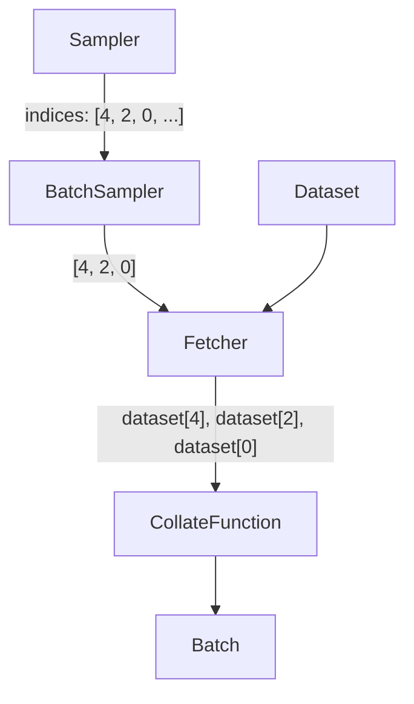
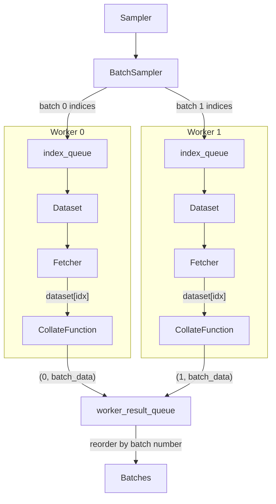
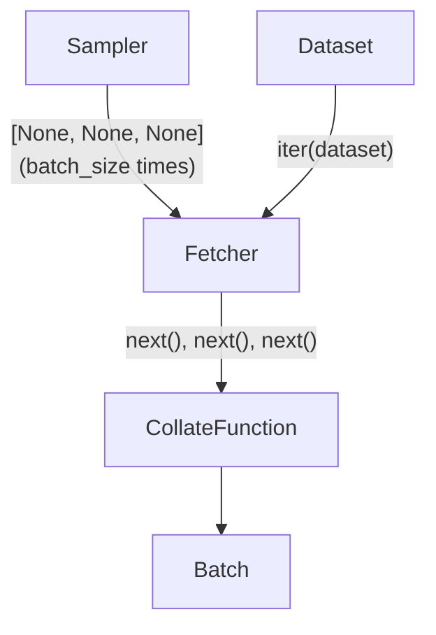
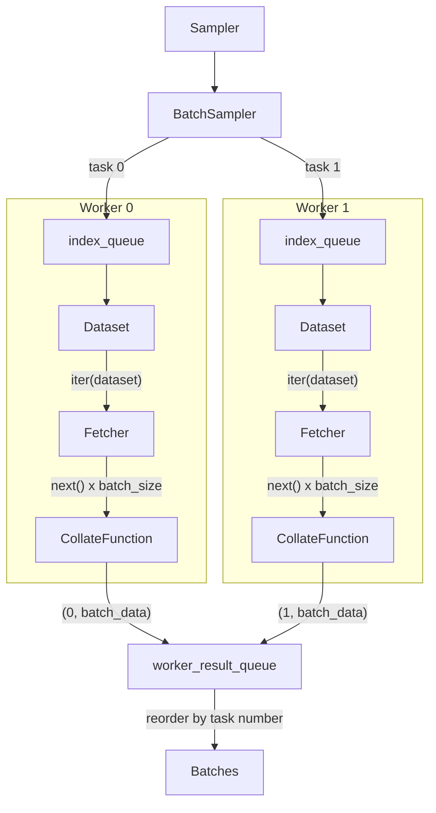

# DataLoader Architecture

Visual guide to how PyTorch DataLoaders work internally.

---

## Component Overview

### Map-Style Components

| Component | Class | Role |
|-----------|-------|------|
| **Dataset** | User-provided | Defines `__getitem__` and `__len__` |
| **Sampler** | `SequentialSampler` (`RandomSampler` if `shuffle=True`) | Produces indices that control access order |
| **BatchSampler** | `BatchSampler` | Groups sampler indices into lists of `batch_size` |
| **Fetcher** | `_MapDatasetFetcher` | Calls `dataset[idx]` for each index in a batch |
| **CollateFunction** | `default_collate` | Converts list of samples into a batch tensor |
| **WorkerQueues** | `index_queue` + `worker_result_queue` | Distributes work to and collects results from workers |

### Iterable-Style Components

| Component | Class | Role |
|-----------|-------|------|
| **Dataset** | User-provided | Defines `__iter__` |
| **Sampler** | `_InfiniteConstantSampler` | Dummy sampler that yields `None` forever |
| **BatchSampler** | `BatchSampler` | Counts how many items to pull per batch |
| **Fetcher** | `_IterableDatasetFetcher` | Calls `next(dataset_iter)` x `batch_size` to fill a batch |
| **CollateFunction** | `default_collate` | Converts list of samples into a batch tensor |
| **WorkerQueues** | `index_queue` + `worker_result_queue` | Distributes work to and collects results from workers |

---

## Map-Style: Single Worker (`num_workers=0`)

Everything runs in the main process. The Sampler controls access order.

**Key point:** The Sampler decides the order. The Fetcher just calls `dataset[idx]` for each index in the batch.

---

## Map-Style: Multiple Workers (`num_workers>0`)

Workers fetch data in parallel, but the output queue preserves Sampler order.

**Key point:** Each worker has its own `index_queue` and a copy of the Dataset. Each batch is tagged with a batch number. The main process yields batches in order of that number via the shared `worker_result_queue`, even if Worker 1 finishes before Worker 0. This is why map-style ordering is deterministic regardless of worker timing.

---

## Iterable-Style: Single Worker (`num_workers=0`)

The Dataset controls iteration. The Sampler is a dummy that just counts batch slots.

**Key point:** No real Sampler. The Fetcher calls `next()` on the Dataset's iterator `batch_size` times to fill each batch. The Dataset decides what comes out.

---

## Iterable-Style: Multiple Workers (`num_workers>0`)

Each worker gets its own copy of the Dataset and its own iterator.

**Key point:** Each worker has an independent copy of the Dataset and iterator. Without sharding logic in `__iter__`, every worker yields the full dataset (data duplication). The task-number reordering preserves the round-robin assignment order, but the *content* depends on what each worker's iterator yields — which can be timing-dependent.

---

## Map-Style vs Iterable-Style: Summary

|  | Map-Style | Iterable-Style |
|--|-----------|----------------|
| **Who controls order?** | Sampler (external to Dataset) | Dataset's `__iter__` (internal) |
| **Shuffling** | `shuffle=True` on DataLoader | Must implement in `__iter__` |
| **Multi-worker** | Automatic index distribution | Must shard manually |
| **Deterministic order** | Yes (Sampler + output queue) | Depends on worker timing |
| **`len()` support** | Yes (`__len__`) | No |
